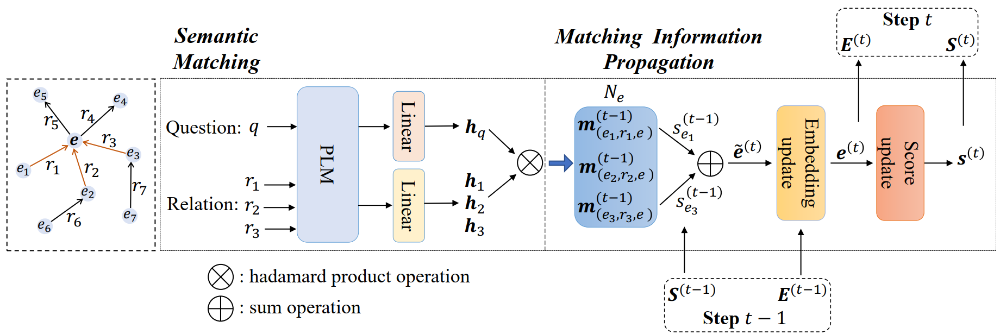

# UniKGQA
This is the official PyTorch implementation for the paper:
> UniKGQA: Unified Retrieval and Reasoning for Solving Multi-hop Question Answering Over Knowledge Graph - [ICLR 2022](https://arxiv.org/pdf/2212.00959.pdf)  
> Jinhao Jiang*, Kun Zhou*, Wayne Xin Zhao, Ji-Rong Wen

*Updates:*
1. - [x] Update camera-ready code repo!
2. - [ ] Update camera-ready paper!
3. - [ ] Upload our results to the leaderboard!

## Overview
We propose **UniKGQA**, which stands for **Uni**fied retrieval and reasoning for solving multi-hop **Q**uestion **A**nswering over **K**nowledge **G**raph.
It's a unified model architecture based on pre-trained language models (PLMs) for both retrieval and reasoning stages, 
which consists of the ***Semantic Matching*** module and the ***Matching Information Propagation*** module.
Furthermore, we design an effective learning strategy with both pre-training (i.e., ***Question-Relation Matchin***) and
fine-tuning (i.e., ***Retrieval on Abstract Subgraphs*** and ***Reasoning on Retrieved Subgraphs***) based on the unified architecture.
With this unified architecture, the proposed learning method can effectively enhance the sharing and transferring of relevance information between the two stages.

## Environments Setting
We implement our approach based on Pytorch and Huggingface Transformers.
We export the detailed environment settings in the freeze.yml, and you can install them with the command line as follows:

    conda env create -f freeze.yml

## Preparing the datasets
We preprocess the datasets following NSM.
You can see the *Preprocess* directory for details.

## Preparing the KG
For WebQSP and CWQ, we use the whole freebase as the knowledge base.
We strongly suggest that you follow Freebase-Setup to build a Virtuoso for the Freebase dataset.
Following NSM and GraftNet, to improve the data accessing efficiency when training, we extract a 2-hop topic-centric subgraph for each question in WebQSP and a 4-hop topic-centric subgraph for each question in CWQ to dump the necessary facts.
Then, we access these necessary facts efficiently with sparse matrix multiplication based on the publicly released code of SubgraphRetrieval.
You can see the *KnowledgeBase* directory for details.

**Note: these two processes are time-consuming, so we strongly suggest you download our preprocessed data and KG dump from [here]().**

## Pre-training
We utilize the shortest path between topic entities and answer entities in KG to pre-training the PLM for question-relation semantic matching.

### Preparing weakly supervised pre-training data
First, we should extract the shortest relation path in KG. Here, we give an example of the WebQSP dataset.
Second, we filter some relation paths whose answer precision is lower than a specified threshold (we use 0.1 here).
Third, we regard the relations in the above-extracted relation paths as positive relations and randomly select other relations as negative relations.
Finally, we can get the pre-training data. Each sample format is *(question, positive relations, negative relations)*.
You can construct these data as follows:
    
    cd ./UniModel
    
    sh prepare_weak_super_pre_train_data.sh

**Note: this process is time-consuming, so we strongly suggest you download our pre-processed training data from [here]().**

### Pre-training with Question-Relation Matching
Based on the publicly released code of SimCSE, we pre-train the PLM with contrastive learning as follows:
    
    cd ./UniModel

    CUDA_VISIBLE_DEVICES=1,2,3 python3 -W ignore -m torch.distributed.launch \
    --nproc_per_node 3 --master_port 1237 ./retriever/train.py --model_name_or_path roberta-base \
    --train_file ./data/webqsp/new.train.rels.retri.data.neg_50.0.1.csv \
    --eval_file ./data/webqsp/new.dev.rels.retri.data.neg_50.0.1.csv \
    --output_dir ./retriever/results/new_webqsp_rel_retri_1 --per_device_train_batch_size 10 --gradient_accumulation_steps 2 \
    --learning_rate 5e-5 --do_train --num_train_epochs 15 --do_eval --evaluation_strategy steps --eval_steps 300 \
    --save_steps 300 --save_total_limit 1 --load_best_model_at_end --metric_for_best_model eval_hits1 --pooler_type cls \
    --overwrite_output_dir --temp 0.05

    python ./retriever/simcse_to_huggingface.py --path ./retriever/results/new_webqsp_rel_retri_1/

**Note: we almost do not fine-tune any hyper-parameters, such as learning rate, temperature, and the number of negatives.**

## Fine-tuning
After pre-training the PLM, we initialize the UniKGQA with the pre-trained parameters.
Then, we fine-tune other parameters during the retrieval and reasoning stages.

### Extracting the Abstract Subgraphs from KG
First, we should construct the abstract subgraph from the original KG.
When we shrink the abstract subgraph, we can leverage the pre-trained PLM for filtering obviously irrelevant relations.
    
    cd ./UniModel
    
    sh extract_abstract_subgraph_from_kg.sh

    
### Fine-tuning for Retrieval on Abstract Subgraphs
Second, we fine-tune our UniKGQA reasoning model (UniKGQA-ret) on the abstract subgraph.
Note we initialize the PLM module of UniKGQA-ret with the pre-trained parameters and fix them during the fine-tuning.
You can train the UniKGQA-ret as follows:
    
    cd ./UniModel/nsm_retriever

    CUDA_VISIBLE_DEVICES=2 python3 main_nsm.py --linear_dropout 0.1 --log_steps 50 \
    --model_path ../retriever/results/new_webqsp_rel_retri_1/ --agent_type PLM --instruct_model PLM --model_name gnn --data_folder ../data/webqsp/ \
    --data_name .abs.sg.topk.15.min_sim.0.max_tris.1000.new_rel_retri_1.nsm.json \
    --checkpoint_dir ../retriever_ckpt/webqsp_nsm/ --experiment_name retriever_p_t_wo_pooler \
    --batch_size 40 --gradient_accumulation_steps 1 --test_batch_size 400 --num_step 3 \
    --entity_dim 768 --word_dim 300 --kg_dim 384 --kge_dim 100 --eval_every 1 --encode_type \
    --eps 0.95 --num_epoch 100 --patience 15 --use_self_loop --plm_lr 1e-5 --lr 5e-4 \
    --word_emb_file word_emb_300d.npy --loss_type kl --reason_kb --data_cache ../data/webqsp/new_abs_r1_sg_for_retri.cache \
    --relation2id new_abs_r1_relations.txt --entity2id new_abs_r1_entities.txt \
    --simplify_model --fixed_plm_for_relation_encoding --fixed_plm_for_query_encoding --fix_all_plm

**Note: you only need to focus on the learning rate hyper-parameter.**

### Performing Retrieval with UniKGQA
After fine-tuning the UniKGQA-ret, you can leverage it to retrieve the subgraph for the latter reasoning stage as follows:
    
    cd ./UniModel
    
    sh perform_retrieval.sh

Note: you can directly download the retrieved subgraph data from [here]().

### Fine-tuning for Reasoning on Retrieved Subgraphs
After obtaining the retrieved subgraph, you can fine-tune the UniKGQA reasoning model (UniKGQA-rea).
Note we initialize the UniKGQA-rea with UniKGQA-ret to share the learned knowledge during the retrieval stage and still fix the parameters of the PLM module.
You can train the UniKGQA-ret as follows:
    
    CUDA_VISIBLE_DEVICES=1 python3 ./nsm_retriever/main_nsm.py --linear_dropout 0.1 --log_steps 50 \
    --retriever_ckpt_path ./retriever_ckpt/webqsp_nsm/retriever_p_t_wo_pooler-f1.ckpt \
    --model_path ./retriever/results/new_webqsp_rel_retri_1/ \
    --relation_model_path ./retriever/results/new_webqsp_rel_retri_1/ \
    --agent_type PLM --instruct_model PLM --model_name gnn \
    --data_folder ./data/webqsp/ --data_name .reason.sg.max_tris.700.const_reverse.json \
    --checkpoint_dir ./retriever_ckpt/webqsp_rea/ --experiment_name reason_p_t_wo_pooler_f1 \
    --batch_size 40 --gradient_accumulation_steps 1 --test_batch_size 80 --num_step 3 --entity_dim 768 --word_dim 300 \
    --kg_dim 384 --kge_dim 100 --eval_every 1 --encode_type --eps 0.95 --num_epoch 120 \
    --patience 15 --use_self_loop --plm_lr 1e-5 --lr 5e-4 --word_emb_file word_emb_300d.npy --loss_type kl --reason_kb \
    --relation2id new_reason_r1_relations.txt --entity2id new_reason_r1_entities.txt \
    --simplify_model --fixed_plm_for_relation_encoding --fixed_plm_for_query_encoding --fix_all_plm

**Note: you only need to focus on the learning rate hyper-parameter.**

## Acknowledge
Our code refers to the publicly released code of NSM, SimCSE, and SubgraphRetrieval.
Thanks for their contribution to the research.